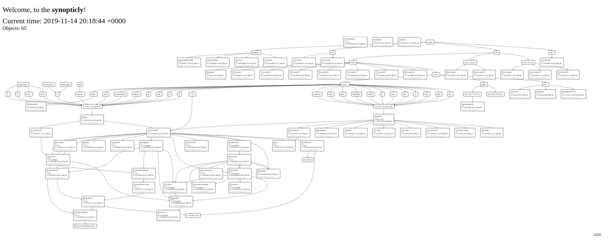

# synopticly

Simple service discovery software package consisting of agent, API and visualization panel. Targeting microservices monitoring as well as its data flows betweem particular environment components.



## PROJECT GOALS
Looking for software-based synoptic panel for application cluster monitoring (e.g. *OpenShift*/*OKD* with *Docker* cointainers). Thinking of employing *Elasticsearch* + *Kibana* (canvas, visualizations), Grafana or even built monitoring into recent *OKD* versions. Found it too complicated to fit into our timeframe for this task. Here you have much simpler aproach, which does exactly what it should from our perspective.

## COMPONENTS

The following components provide basic functionality of **synopticly** prototype. Once it will reach its required maturity will migrate from this software scaffold to something more appropriate in terms of applying it in enterprise environment.

### (a) agent
This component (c++, 64-bit Linux only, static linking) runs inside your *Docker* container taking environment data and send it to the API server.
- https://github.com/elnormous/HTTPRequest
- https://github.com/nlohmann/json
- https://www.boost.org/doc/libs/1_57_0/doc/html/string_algo/usage.html
- https://github.com/yhirose/cpp-httplib
- https://csl.name/post/lua-and-cpp/
- https://community.vcvrack.com/t/glibcxx-version-in-rhel7/3828/2
- https://forums.fedoraforum.org/showthread.php?271288-liblua5-1-so-0
- https://centos.pkgs.org/7/epel-x86_64/lua-socket-3.0-0.17.rc1.el7.x86_64.rpm.html

You can run agent like this (`Dockerfile`):
```
RUN echo "cd /opt && wget https://github.com/michalasobczak/synopticly/raw/develop/agent/Debug/synopticly-agent" >> /opt/runner.sh
RUN echo "chmod +x /opt/synopticly-agent" >> /opt/runner.sh
RUN echo "/opt/synopticly-agent &" >> /opt/runner.sh
RUN cd /opt/ && echo '{"api_url": "0.0.0.0:4567"}' >> /opt/synopticly_config.json
...
ENTRYPOINT /opt/runner.sh
```
where `0.0.0.0` is your API server IP/host. Configuration file name is `synopticly_config.json` and should be in the same directory as agent binary file. Agent takes `OPENSHIFT_BUILD_NAMESPACE` as application name that will be reported to the API server. 

### (b) API
This component (*Ruby*/*Rack*) runs as *Docker* container (`michalasobczak/synopticly`) being a *Sinatra* server listening for incoming reports from agents all across the cluster. Requires `DATABASE_HOST`, `DATABASE_PASS`. It assumes that database name and user is set to `synopticly` for sake of simplicity. One can run this on *Portainer*. Please remember to map ports appropriately as well as set restart policy to always.

- https://github.com/sinatra/sinatra
- https://github.com/janko/sinatra-activerecord

Database configuration is defined in `config/database.yml`. You can find all migrations in `db/migrate`. You need to create `synopticly` database owned by `synopticly` user. Migrations can be run via `rake db:migrate` with environment variables set.

### (c) visualization panel
This component (*Rub*y/*Rails*) provides visualization user interface taking into account data registered from agents thru API in the `synopticly` database. Provides synoptic diagram based on `d3`, `graphlib-dot` and `dagre-d3`. Runs as *Docker* container (`michalasobczak/synopticly-visualization-panel`).

## FURTHER READING
- https://hub.docker.com/r/michalasobczak/synopticly
- https://github.com/dagrejs/graphlib-dot/wiki
- https://graphviz.gitlab.io/_pages/doc/info/lang.html

## ROADMAP

- r0/alpha: (first working prototype): 
  - agent takes container data and sends it to API server which saves it in the storage (e.g. database), 
  - user can have an outlook of applications running in the cluster, 
  - aim for 50 applications running at a time sending data every second
- r1:
  - agent reads more data
  - agent read application metrics (from file, pipe, database, memory etc.)
  - enriching diagram with more data and additional metrics
  - add application relationship management
- r2: 
  - add user authentication and authorization in visualization panel
  - add data security between agent and API (*Nginx* proxy-pass with TLS or data encryption w/o TLS)
  - data rolling up, table partitioning, maintenance tasks
- r3: 
  - server monitoring including linking apps to VMs
  - visualization styling

## NOTICE
Please bear in mind that currently this software is not production ready yet. It will be clearly mentioned here. I will provide compatible/optimized builds there on GitHub.

## DISCLAIMER
THE SOFTWARE IS PROVIDED "AS IS", WITHOUT WARRANTY OF ANY KIND, EXPRESS OR IMPLIED, INCLUDING BUT NOT LIMITED TO THE WARRANTIES OF MERCHANTABILITY, FITNESS FOR A PARTICULAR PURPOSE AND NONINFRINGEMENT. IN NO EVENT SHALL THE AUTHORS OR COPYRIGHT HOLDERS BE LIABLE FOR ANY CLAIM, DAMAGES OR OTHER LIABILITY, WHETHER IN AN ACTION OF CONTRACT, TORT OR OTHERWISE, ARISING FROM, OUT OF OR IN CONNECTION WITH THE SOFTWARE OR THE USE OR OTHER DEALINGS IN THE SOFTWARE.
